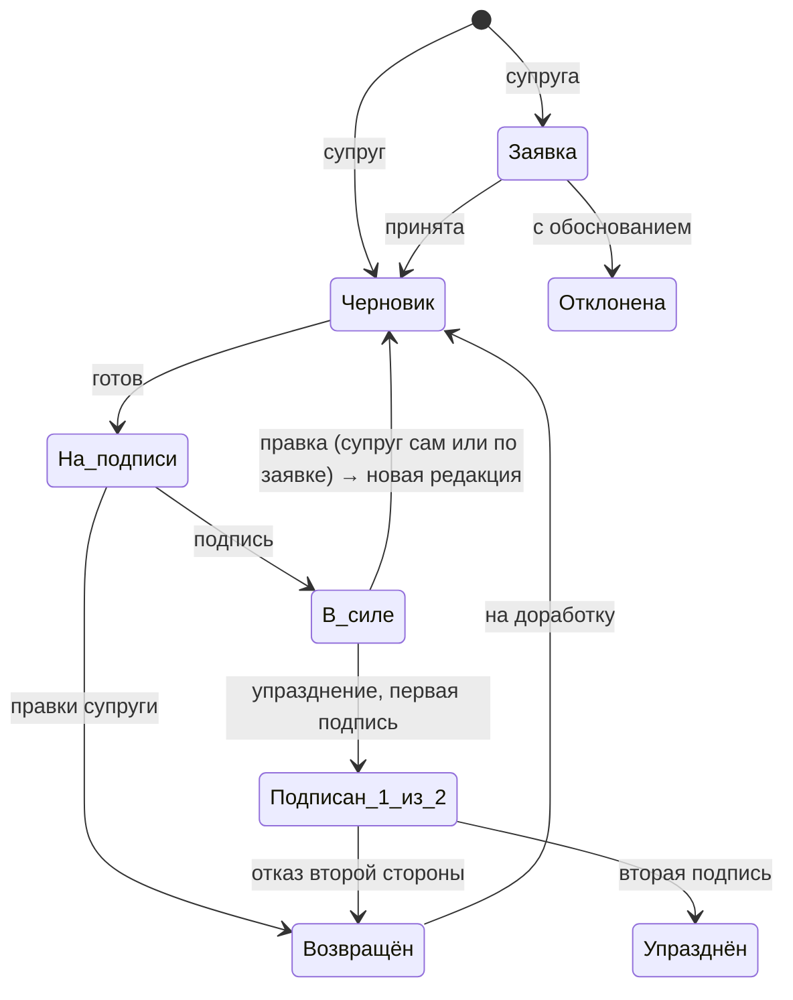

# Пакт — спецификация и план

01.10.2026

## Обзор

Пакт — PWA для телефона, в которой пожелания супруги превращаются в пронумерованные законы: LLM размечает и переписывает текст, супруг готовит законопроект, супруга подписывает. Бэкенд работает на сервере супруга, LLM подключается по API.

Принципы, которые не нарушаются нигде в системе:

- В Пакте только законы, других типов записей нет.
- Принятый закон нельзя удалить, только упразднить. Номер закона никогда не меняется и не переиспользуется.
- Закон вступает в силу только с подписью супруги, упразднение — только с подписями обоих.
- Исходный текст пожелания хранится всегда и скрыт под официальной формулировкой.
- Каждое действие пишется в неизменяемый журнал с хеш-цепочкой.

## Роли и права

Учётных записей две, с фиксированными ролями: Супруг готовит законы, Супруга их подписывает и подаёт заявки.

| Действие | Супруг | Супруга |
| --- | --- | --- |
| Создать черновик закона | да | нет |
| Видеть черновики и разметку LLM | да | нет |
| Править теги, текст, место в структуре | да | нет |
| Отправить законопроект на подпись | да | нет |
| Подписать законопроект | нет | да |
| Вернуть законопроект с правками | нет | да |
| Подать заявку: новый закон, правка, упразднение | нет | да |
| Рассмотреть заявку супруги | да | нет |
| Инициировать упразднение | да | через заявку |
| Подписать упразднение | да | да |
| Читать Пакт, раскрывать исходный текст | да | да |
| Спросить Пакт | да | да |
| Отмечать исполнение закона | да | нет |

Авторизация: логин и пароль, долгоживущая сессия в httpOnly-cookie. Регистрации нет, обе записи создаются при установке.

## Жизненный цикл

Любое изменение Пакта — новый закон, правка или упразднение — проходит через законопроект, и в силу он вступает только после подписи.



- **Заявка** супруги бывает трёх видов: новый закон, правка действующего, упразднение. Супруг берёт её в работу как черновик или отклоняет с обоснованием.
- **Черновик** видит только супруг. Супруга не видит его до отправки на подпись.
- **Возвращён**: если супруга вносит правки при подписи, проект уходит к супругу на повторную проверку разметки и снова на подпись.
- **Правка действующего закона** создаёт новую редакцию с тем же номером.
- **Правку** супруг может начать сам, без заявки. Новая редакция вступает в силу только с подписью супруги, до этого действует прежняя.
- **Упразднение** может предложить каждый, вступает в силу после подписей обоих. Первым подписывает инициатор, а по заявке супруги — супруг. Вторая сторона может отказаться через `return` с комментарием. Система показывает законы, которые ссылаются на упраздняемый.
- **Возврат** — только комментарий (`wife_comment`). Текст и разметку правит супруг.

## Структура и нумерация

Пакт устроен в три уровня: Раздел → Статья → Закон, номер закона вида 4.1.1. Номер присваивается в момент подписания и закрепляется навсегда.

- **Раздел** (4. Цветы) и **Статья** (4.1 Вечная ваза) создаются вместе с первым законом, который в них попадает. Удалить их нельзя, даже если все законы внутри упразднены.
- **Закон** (4.1.1 Следить за свежестью цветов в Вечной вазе) содержит официальный текст, скрытый исходник, теги, расписание и ссылки на другие законы.
- **Черновик** показывает предварительный номер. Окончательный берётся следующим свободным в статье при подписании, чтобы два параллельных проекта не заняли один номер. Номера новых разделов и статей тоже присваиваются при подписании. Если к этому моменту раздел или статья с тем же названием уже есть, проект попадает в них, а дубль не создаётся.
- **Упразднённый закон** остаётся на своём месте с пометкой «Утратил силу» и датой. Его номер больше никогда не выдаётся.
- **Редакции**: правка действующего закона создаёт новую редакцию с тем же номером. Предыдущие редакции хранятся и доступны в истории закона.

## LLM-конвейер

Конвейер запускается, когда супруг создаёт черновик или берёт в работу заявку. Он выдаёт готовое предложение, которое супруг правит перед отправкой на подпись. Все вызовы идут через OpenAI-совместимый клиент: `base_url`, модель для текста и модель для эмбеддингов задаются в настройках, так что облачный API и локальная Ollama меняются без правки кода. Для старта выбраны `gpt-4.1-mini` и `text-embedding-3-small` (размерность 1536). Если модель эмбеддингов сменится, все эмбеддинги пересчитываются отдельной командой.

1. **Разбор.** Исходный текст → JSON по схеме ниже, structured output.
2. **Подбор места.** Эмбеддинг текста → top-5 похожих статей и разделов. LLM выбирает существующую статью или предлагает новую из этого списка, чтобы не плодить дубли разделов.
3. **Официальная редакция.** Переписывание в стиль Пакта: безличные формулировки, «Супруг обязан…», без потери смысла. Результат сравнивается с исходником вторым вызовом: «потерян ли смысл?»
4. **Проверки.** Top-5 похожих действующих законов → LLM ищет дубли и противоречия. Предупреждения показываются в черновике и не блокируют отправку.
5. **Ссылки.** LLM отмечает законы, на которые новый закон опирается. Супруг подтверждает связи.
6. **Обучение на правках.** Когда супруг меняет разметку, текст или место, пара «предложение LLM → итог» сохраняется. В промпты шагов 1–3 подставляются 3 самых похожих примера (few-shot по эмбеддингам).

Схема разбора:

```json
{
  "title": "Следить за свежестью цветов в Вечной вазе",
  "tags": ["Цветы", "Ежедневно", "Действие"],
  "action": "проверять и менять цветы",
  "object": "Вечная ваза",
  "schedule": {"rrule": "FREQ=DAILY", "time": "19:00"},
  "placement": {"section": "Цветы", "article": "Вечная ваза", "is_new_section": false, "is_new_article": true},
  "official_text": "Супруг ежедневно проверяет состояние цветов в Вечной вазе и заменяет их до утраты свежести, не дожидаясь увядания."
}
```

`schedule` равно `null`, если у закона нет периодичности. Конфиденциальность: при облачном API тексты пожеланий уходят провайдеру, это стоит учесть при выборе.

## Спросить Пакт

Вопрос на естественном языке («что там про цветы?») получает ответ только по действующим законам, со ссылками на номера.

1. Эмбеддинг вопроса → top-8 действующих редакций законов (упразднённые исключены фильтром).
2. LLM отвечает строго по найденным текстам, каждое утверждение со ссылкой вида [4.1.1].
3. Если подходящих законов нет, ответ — «В Пакте об этом ничего не сказано», без догадок.
4. Номера в ответе кликабельны и открывают закон.

Доступно обоим, вопросы не пишутся в журнал.

## Подпись и журнал

**Подпись пальцем.** При подписании открывается полноэкранное окно с белым фоном, линией «Подпись» и кнопками «Очистить» и «Подписать». Рисование на `<canvas>` через Pointer Events с лёгким сглаживанием линии. Кнопка «Подписать» активна, когда нарисовано хотя бы несколько штрихов.

- Сохраняются штрихи (массив точек) и SVG для отображения под законом.
- SHA-256 от SVG записывается в журнал вместе с хешем подписываемого текста. Подпись привязана к конкретной редакции.
- Под законом в Пакте отображается подпись и дата вступления в силу. У упразднения две подписи.

**Журнал.** Таблица только для добавления: каждое событие (создан черновик, отправлен на подпись, возвращён, подписан, заявка подана, упразднён, исполнено) — это запись с `prev_hash` и `hash = SHA-256(prev_hash + payload)`.

- На уровне БД у роли приложения нет прав `UPDATE` и `DELETE` на журнал и подписи.
- Команда проверки цепочки пересчитывает хеши и сообщает первую несовпавшую запись.
- Ежедневный бэкап БД (`pg_dump`) и последний хеш цепочки отдельно, чтобы подмену было видно даже после восстановления.

## Уведомления и календарь

Уведомления идут через Web Push (VAPID), расписание живёт на сервере. Календарь подключается подпиской на ICS-фид.

| Событие | Кому | Кнопки в уведомлении |
| --- | --- | --- |
| Законопроект на подписи | Супруге | Открыть |
| Законопроект возвращён с правками | Супругу | Открыть |
| Подана заявка | Супругу | Открыть |
| Упразднение ждёт подписи | Второй стороне | Открыть |
| Закон вступил в силу или упразднён | Обоим | — |
| Напоминание по расписанию закона | Супругу | Выполнено · Отложить на час |

- **Расписание** берётся из `schedule` закона (RRULE + время), которое супруг подтверждает при подготовке. Планировщик раз в минуту выбирает наступившие напоминания.
- **Часовой пояс** — `Europe/Moscow` (UTC+3), расписания и время в интерфейсе считаются в нём.
- **«Выполнено»** пишет отметку исполнения в журнал. «Отложить» в журнал не пишется. Супруга видит отметки в истории закона. Счётчика нарушений нет.
- **ICS-фид** по адресу с секретным токеном: `/calendar/<token>.ics`, каждый закон с расписанием — повторяющееся событие. Для быстрой синхронизации на Android — ICSx⁵.
- **OnePlus**: отключить оптимизацию батареи для Chrome, иначе push может приходить с задержкой.

## Модель данных

PostgreSQL с расширением pgvector. Законопроект (`bill`) — единая сущность для нового закона, правки и упразднения, поэтому один конвейер подписи обслуживает всё.

| Таблица | Ключевые поля | Назначение |
| --- | --- | --- |
| `users` | id, role (husband / wife), name, password_hash | Две учётные записи |
| `sections` | id, number, title | Разделы |
| `articles` | id, section_id, number, title | Статьи |
| `laws` | id, article_id, number, status (active / repealed), current_version_id, enacted_at, repealed_at | Законы, номер неизменен |
| `law_versions` | id, law_id, version_no, official_text, original_text, tags, schedule, embedding, signed_at | Редакции закона |
| `bills` | id, kind (new / amend / repeal), target_law_id, status, original_text, llm_result, prepared, wife_comment, reject_reason, created_by | Заявки и законопроекты |
| `signatures` | id, bill_id, user_id, strokes, svg, svg_hash, text_hash, signed_at | Подписи |
| `law_refs` | from_law_id, to_law_id | Перекрёстные ссылки |
| `corrections` | id, stage, input, llm_output, final, embedding | Примеры для few-shot |
| `journal` | seq, ts, actor_id, action, entity, payload, prev_hash, hash | Журнал с хеш-цепочкой |
| `push_subscriptions` | id, user_id, endpoint, keys | Подписки Web Push |
| `reminders` | id, law_id, next_fire_at, snoozed_until | Очередь напоминаний |

`llm_result` хранит сырой ответ конвейера, `prepared` — то, что супруг утвердил. Их разница и становится записью в `corrections`.

## API

REST под `/api`, права проверяются по роли на каждом эндпоинте. Переходы статусов законопроекта выполняются только через отдельные эндпоинты действий, прямого `PATCH status` нет.

| Метод и путь | Кто | Что делает |
| --- | --- | --- |
| `POST /auth/login`, `POST /auth/logout` | оба | Вход и выход |
| `GET /pakt` | оба | Дерево разделов, статей и законов |
| `GET /laws/{id}` | оба | Закон, редакции, подписи, ссылки, исполнение |
| `POST /bills` | оба | Супруг создаёт черновик, супруга подаёт заявку |
| `GET /bills?status=` | оба | Супруг видит все, супруга — свои заявки и проекты на подписи |
| `POST /bills/{id}/analyze` | супруг | Запустить LLM-конвейер |
| `PUT /bills/{id}/prepared` | супруг | Сохранить правки разметки и текста |
| `POST /bills/{id}/submit` | супруг | Отправить на подпись |
| `POST /bills/{id}/accept`, `/reject` | супруг | Взять заявку в работу или отклонить |
| `POST /bills/{id}/return` | супруга | Вернуть с правками и комментарием |
| `POST /bills/{id}/sign` | по правилам | Подписать (штрихи и SVG в теле) |
| `POST /ask` | оба | Спросить Пакт |
| `POST /laws/{id}/done`, `/snooze` | супруг | Отметки из уведомления |
| `POST /push/subscribe` | оба | Регистрация Web Push |
| `GET /calendar/{token}.ics` | по токену | ICS-фид |
| `GET /journal/verify` | супруг | Проверка хеш-цепочки |

## Архитектура и стек

Всё разворачивается одним Docker Compose в `/srv/pact` на общем сервере (Ubuntu 24.04): фронтенд, API, воркер и база. Обратный прокси свой не поднимается: используется общий Caddy сервера (`/opt/filebrowser/Caddyfile`, правится по процедуре из памятки `СЕРВЕР.md`), хост `pact.2-27-10-45.sslip.io` → `reverse_proxy` на порт `127.0.0.1`. Репозиторий: `github.com/6eccmepTHblu/Pact`.

| Компонент | Выбор | Зачем |
| --- | --- | --- |
| Фронтенд | SvelteKit (adapter-static) + PWA-манифест, service worker | Установка на домашний экран, push, офлайн-чтение Пакта |
| API | FastAPI, SQLAlchemy, Alembic, Pydantic | Типизированные схемы совпадают со structured output LLM |
| LLM | пакет `openai` с настраиваемым `base_url` | Облачный API или Ollama без правки кода |
| Воркер | APScheduler | Напоминания, push, фоновые вызовы LLM; без Redis |
| Push | `pywebpush`, ключи VAPID | Уведомления без нативного приложения |
| БД | PostgreSQL 16 + pgvector | Данные, эмбеддинги, журнал |
| Прокси | общий Caddy сервера | Автоматический HTTPS, обязателен для push и PWA |

Доступ снаружи: нужен домен с HTTPS. Если сервер не хочется открывать в интернет, подойдёт Tailscale с сертификатом через `tailscale cert`: push доставляется через Google и работает и в этом случае. Сборку и деплой можно повесить на CI в вашем GitLab.

## План разработки

Шесть этапов, каждый заканчивается рабочей версией. LLM подключается только на третьем: сначала нужен процесс, который работает и с ручным вводом.

- [x] **1. Каркас.** Репозиторий, Docker Compose, Caddy с HTTPS, PostgreSQL, миграции, две учётные записи, журнал с хеш-цепочкой и запретом UPDATE/DELETE. Готово, когда событие входа пишется в журнал и `/journal/verify` проходит.
- [ ] **2. Ядро Пакта без LLM.** Разделы, статьи, законы, законопроекты с ручным вводом, машина статусов, окно подписи пальцем, просмотр Пакта со скрытым исходником, редакции и упразднение с двумя подписями. Готово, когда первый закон подписан на телефоне.
- [ ] **3. LLM-конвейер.** Разбор по JSON-схеме, подбор места по эмбеддингам, официальная редакция, сохранение правок в `corrections` и few-shot. Готово, когда пример с Вечной вазой проходит путь от исходника до закона 4.1.1.
- [ ] **4. Проверки и ссылки.** Дубли и противоречия, перекрёстные ссылки, предупреждение о зависимых законах при упразднении.
- [ ] **5. Заявки и уведомления.** Заявки супруги на новый закон, правку и упразднение, Web Push между ролями, напоминания по расписанию с «Выполнено / Отложить», ICS-фид.
- [ ] **6. Спросить Пакт.** RAG по действующим редакциям с цитированием номеров.
